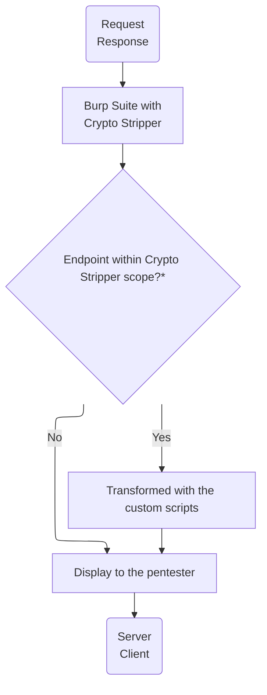

# Crypto Stripper

> [!NOTE]  
> This is a work in progress, playground, full documentation and wiki will be available soon.

`Crypto Stripper` is a `Burp Suite` extension designed to facilitate the penetration testing of applications that implement encryption for HTTP requests and responses.

It is intended as a general-purpose solution, capable of operating across a broad range of encryption implementations, rather than being constrained to specific schemes or narrowly defined use cases. For example:

- [Symmetric encryption with randomly generated keys](https://github.com/dfuribez/crypto-stripper/wiki/Bypassing-symmetric-encryption).
- Asymmetric encryption, regardless of whether the keys are hardcoded or dynamically generated and exchanged via separate requests.
- [Bypassing signature verification mechanisms](https://github.com/dfuribez/crypto-stripper/wiki/Bypassing-signature-verification)
- Enables seamless integration with external tools such as SQLMap, ffuf, and similar automated testing frameworks.
- All of the above, and more.

The extension does not perform any encryption or decryption on its own; instead, it relies on a pentester-provided script that implements the required transformation logic. The script receives the complete request or response and returns the transformed output.

>[!IMPORTANT]
>\* To allow for even more granularity, Crypto Stripper is not triggered on every request or response, even if it falls within the Burp Suite scope. In real-world scenarios, not all application requests are encrypted, nor are they necessarily encrypted or signed using the same method across all endpoints.     To address this, Crypto Stripper implements its own scoping mechanism. This scope can be defined on a per-endpoint basis or through the use of regular expressions. [Read more]()

# How to start?
1. Download and install the [latest available release](https://github.com/dfuribez/crypto-stripper/releases).
2. [Set up the core extension settings](https://github.com/dfuribez/crypto-stripper/wiki/Configuration).
3. Write your response/request scripts.
4. Include the target endpoint in the Stripper scope.
5. Test that the scripts work as intended
6. Have fun ;-)

# Examples
To understand a little better how to play with the extension, a playground is available

- Bypassing asymmetric encryption
- [Bypassing signature verification](https://github.com/dfuribez/crypto-stripper/wiki/Bypassing-signature-verification)
- [Bypassing symmetric encryption](https://github.com/dfuribez/crypto-stripper/wiki/Bypassing-symmetric-encryption)
- [Using automatic and external tools](https://github.com/dfuribez/crypto-stripper/wiki/Using-automatic-and-external-tools)
- [Bypassing client-side validations](https://github.com/dfuribez/crypto-stripper/wiki/Bypassing-client-side-validations)
