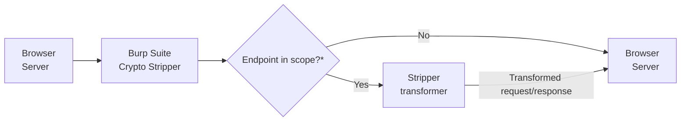

# Crypto Stripper

> [!NOTE]  
> This is a work in progress, playground, full documentation and wiki will be available soon.

`Crypto Stripper` is a `Burpsuite` extension designed to help in the task of pentesting applications with encrypted responses/requests.

This aims to be a general purpose tool so it works on every possible encryption scenario (and more), for example:

- Symmetric encryption with a random generated key (the key can be shared anywhere in the request/response headers, body, etc, it does not matter)
- Asymmetric encryption bypass
- Signature verification bypass
- All of above at once and more

The extension does not perform any encryption/decryption by itself, it relies on a script provided by the pentester with the logic of the transformations to apply. The script receives the entire request/response and returns the transformations.

This process is automatic and transparent for the pentester so tools like burp's intruder, SQLMap, fuzzers, etc can be used along with this extension.

>[!IMPORTANT]
>\* the stripper scope is not the same as burp's scope you can read more about this [here](https://)

# How to start?
1. Install the latest available release (Burp -> Extensions -> Add)
2. Set the basic extension settings (transformers and binary paths) [here]()
3. Program you transformations [here]()
4. Add the desired endpoint to the stripper scope (right click on the request in proxy/repeater -> Extensions -> Crypto Stripper -> Add to scope) [here]()
5. If the request is the original, then decrypt it Right click -> Extensions -> Crypto Stripper -> Decrypt
6. Test that the transformers work as intended [here]()
7. Have fun

# Examples
To understand a little better how to play with the extension, a playground is available [here](https:)

- [Bypassing asymmetric encryption]()
- [Bypassing signature verification]()
- [Bypassing symmetric encryption]()
- [Using automatic tools]()
